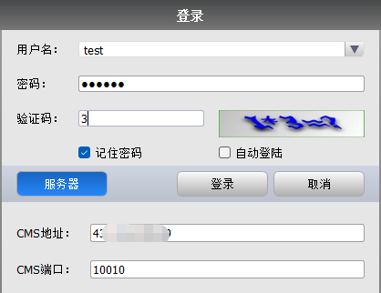
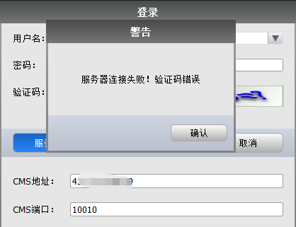
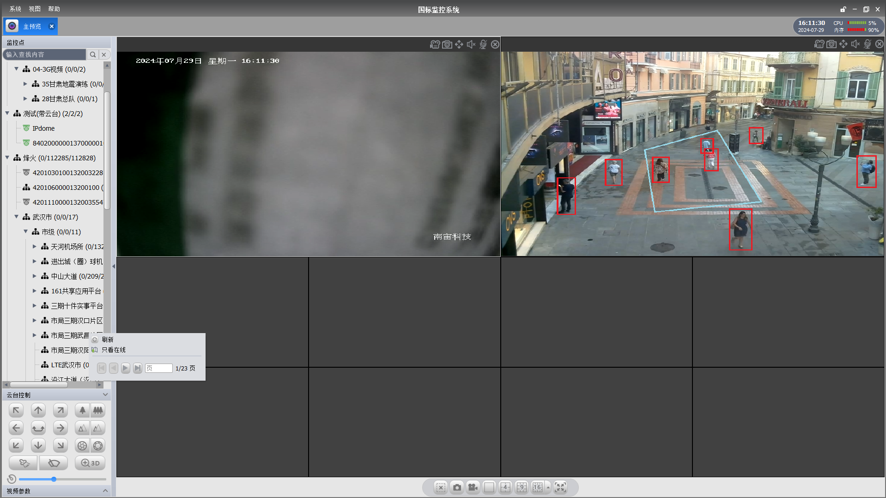
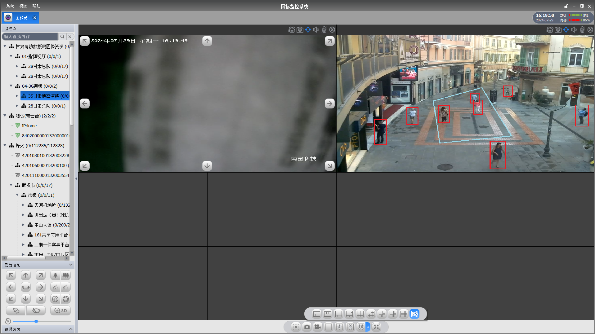
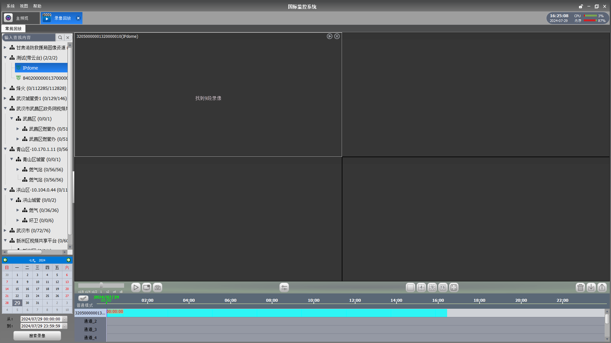
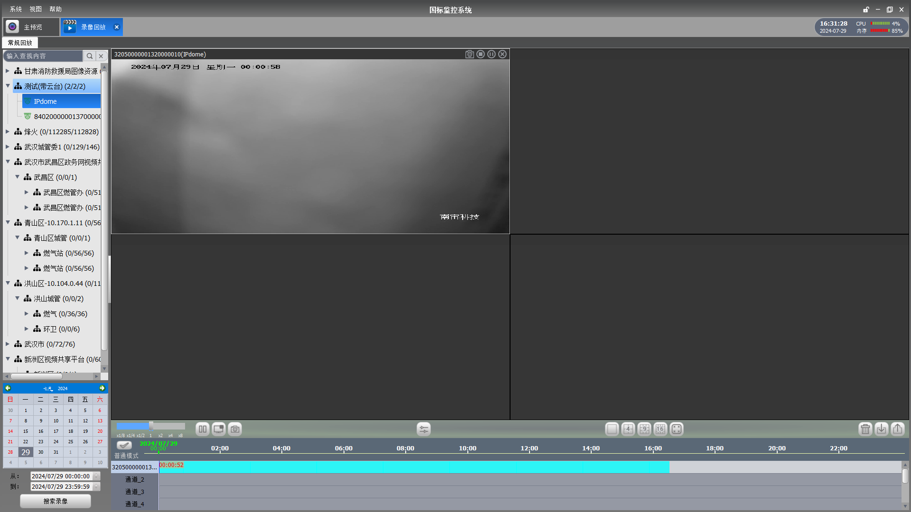
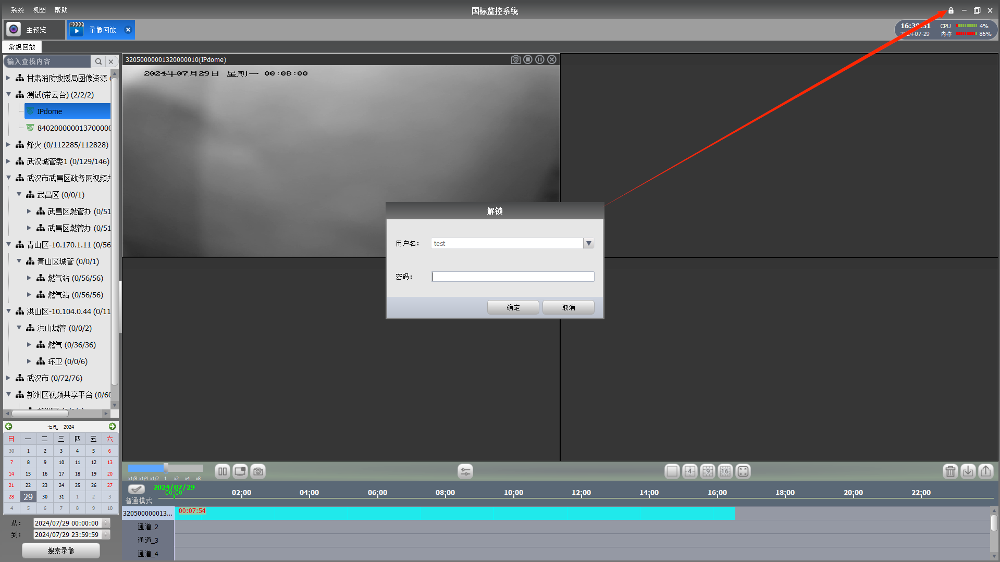
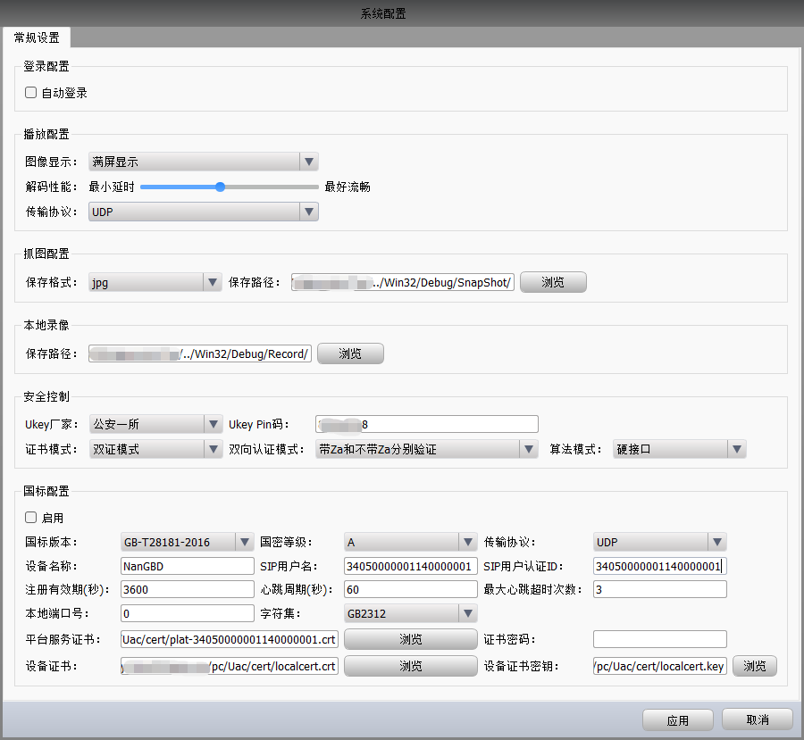

# NanGBD-PC

NanGBD-PC（即 Nanuns GB Device，国标PC设备端）是一套支持 GB/T 28181 和 GB 35114 [国标协议](https://github.com/nanguantong/GB-Doc)的PC设备端软件。  
NanGBD (包含 [NanGBD-Android](https://github.com/nanguantong/NanGBD-Android)) 和 [NanGBS](https://github.com/nanguantong/NanGBS)（即 Nanuns GB Server，国标平台端） 系列支持 Windows、Linux、Mac、Android、iOS、ARM 全平台。

# 应用场景

* 可用于各种泛安防智能监控的终端。
* 可用于设备的非标转国标需求，利旧改造。
* 可用于跨网互联互通、音视频推流、语音双向对讲等国标或非标场景。

# 功能特性

- [X]  兼容国标 GB-T 28181-2011、GB-T 28181-2016、GB 35114（ABC级）
- [X]  多种协议登录到后台平台、网关系统，如JWT-Token、Auth2、国标协议等
- [X]  设备支持公网/内网环境（UDP/TCP）
- [X]  设备注册（单向和双向）、注销、周期性保活
- [X]  设备信息设置与获取
- [X]  设备在线、离线状态维护与获取
- [X]  设备报警与通知
- [X]  设备控制，包括云台控制（PTZ、焦距、光圈、3D定位、灯光、雨刷、巡航、预置位、看守位）、录制控制、设备配置
- [X]  设备视频参数配置，如帧率、码率、分辨率
- [X]  多种协议播放，如RTSP、HTTP-FLV、HTTP-HLS、WebRTC等
- [X]  支持 H264、H265 软硬解码、SVAC 软解码
- [X]  设备实时取流（UDP/TCP）
- [X]  设备录制、录制控制与设置、取历史回放视频流（UDP/TCP）
- [X]  录像时间轴显示，全部播放、停止、抓图、速度控制，同步、异步回放
- [X]  设备公网/内网语音对讲
- [X]  动态抓图并配置保存位置
- [X]  电子地图标注
- [X]  多画面多种网格视频展示
- [X]  动态视频监看轮询
- [X]  双击或拖拽设备进行单个或多个视频同时播放与回放
- [X]  大并发分页加载多级设备目录树、检索与状态过滤
- [X]  UKey厂家支持公安一所、国芯、卫士通、万协通、信安等
- [X]  动态配置设备证书和设备证书密钥
- [X]  动态配置平台系统证书和证书密码
- [X]  AI智能物体检测和识别渲染
- [X]  动态监测本地系统CPU和内存负载状态
- [X]  授权认证（App key / secret）
- [X]  可定制化功能（客户端、AI智能检测和识别 等）

# 运行截图

# 联系我们
[上海南宙科技有限公司](https://www.nanuns.com)  
QQ 群：720153574
